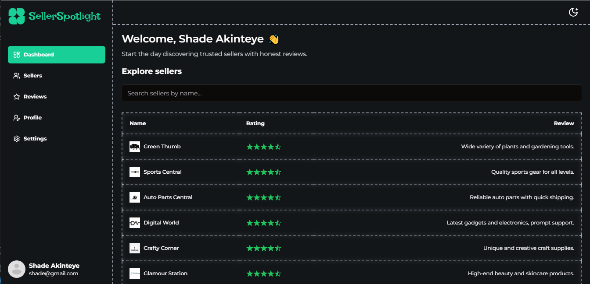

# SellerSpotlight

> This web application is built with the MERN stack.



## Features

-   Display of all sellers
-   Showcase seller ratings & reviews
-   Seller pagination
-   Sellers search feature
-   Database seeder (sellers)
-   Responsive design (Tailwind)
-   Animated loader
-   Toast notifications
-   Route protection
-   Custom 404 page

### Env Variables

-   Get your MongoDB connection string from your MongoDB Atlas cluster and add it to MONGODB_URI.
-   Add a secret to JWT_SECRET. You can generate with the following command:

```
openssl rand -base64 32
```

Create a .env file in then root and add the following

```
NODE_ENV = development
PORT = 5000
MONGO_URI = your mongodb uri
JWT_SECRET = 'abc123'
CLIENT_URL = http://localhost:5173
```

### Install Dependencies (frontend & backend)

```
npm install
cd frontend
npm install
```

### Run

```
# Run frontend (PORT:5137)
npm run dev

# Run backend (PORT:5000)
npm run server
```

Open http://localhost:5137 with your browser to see the result.

## Build & Deploy

```
# Create frontend prod build
cd frontend
npm run build
```

### Seed Database

You can use the following commands to seed the database with some sample sellers as well as destroy all data

```
# Import data
npm run data:import

# Destroy data
npm run data:destroy
```

```
Sample User Logins

admin@example.com (Admin)
Test Admin
1234567890

john@example.com (Customer)
John Doe
1234567890

jane@example.com (Customer)
Jane Doe
1234567890
```

## License

The MIT License

Copyright (c) 2024 Tomiwa Adelae https://tomiwaadelae.com.ng
